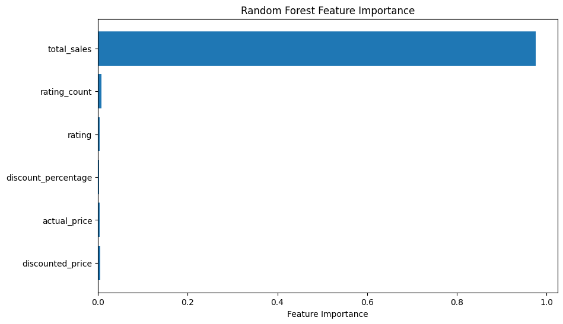
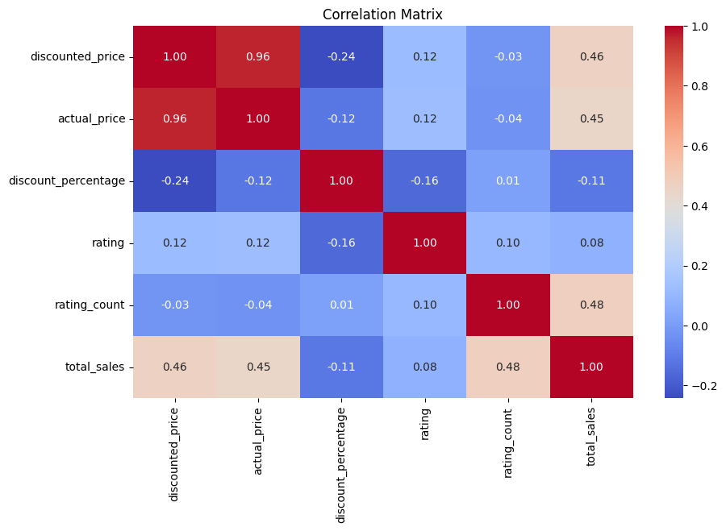
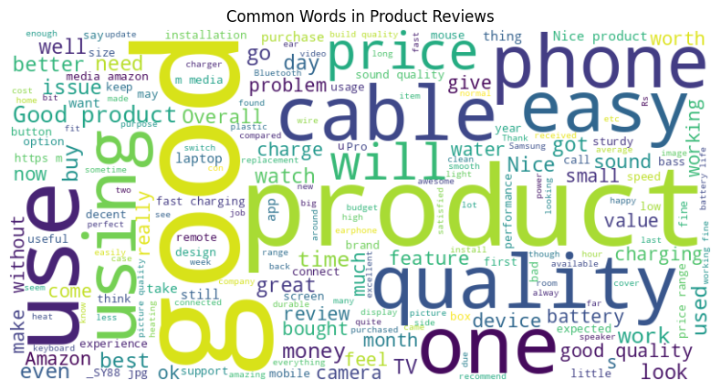
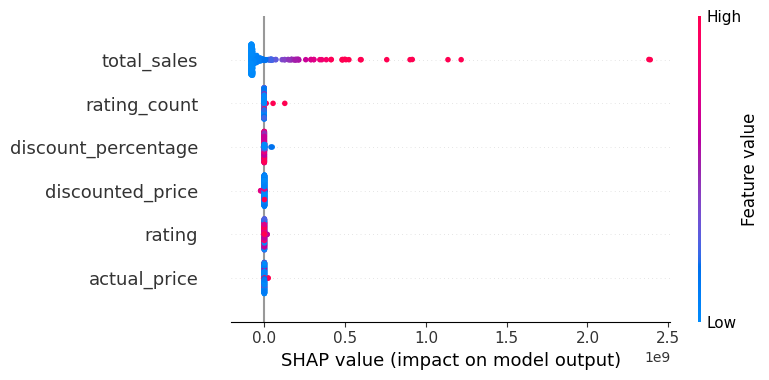
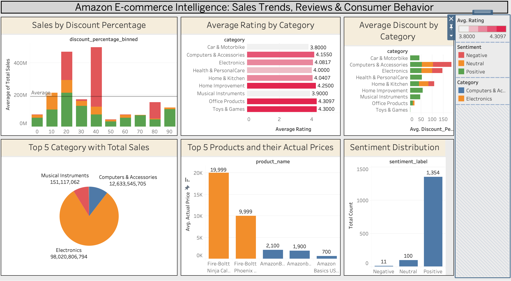

# 🛒 Amazon E-Commerce Business Intelligence Project

A Data Science and Machine Learning project focused on analyzing Amazon E-Commerce data to generate business insights, predict sales trends, and perform sentiment analysis on customer reviews.

---

## 📌 Project Overview

This project analyzes Amazon E-Commerce product data using Data Science, Machine Learning, and Data Visualization techniques.

The project includes:

- Data cleaning and preprocessing
- Exploratory Data Analysis (EDA)
- Feature engineering
- Sales prediction using Machine Learning
- Sentiment analysis on product reviews
- Tableau dashboard visualizations
- Business insight generation

---

## 📂 Dataset

The dataset contains Amazon product-related information such as:

- Product categories
- Ratings and reviews
- Pricing information
- Customer feedback
- Product popularity metrics

---

## 🛠️ Technologies Used

- Python
- Pandas
- NumPy
- Matplotlib
- Seaborn
- Scikit-learn
- TextBlob
- Tableau
- Jupyter Notebook

---

## 📁 Project Structure

```bash
Amazon-ECommerce-Analysis/
│
├── dataset/
│   ├── amazon.csv
│   ├── amazon_final_export.csv
│   └── amazon_final_export_xlsx.xlsx
│
├── notebook/
│   └── Amazon_E_commerce_Project_Code.ipynb
│
├── visualisations/
│    ├── random_forest_feature_importance.png
│    ├── top_10_categories.png
│    ├── correlation_matrix.png
│    ├── top_10_most_reviewed_prds.png
│    ├── SHAP_impact_on_model.png
│    ├── feature_distributions.png
│    ├── top_features.png
│    ├── word_cloud.png
│
├── tableau/
│   ├── visualisation.twb
│   └── visualisation.twbx
│   └── tableau_viz_images/
│
├── report/
│   └── Amazon E-commerce Capstone Project.docx
│
├── requirements.txt
├── README.md
└── .gitignore
```

---

## 📊 Key Features

- Data preprocessing and cleaning
- Sales trend analysis
- Product review sentiment analysis
- Machine Learning-based prediction
- Feature importance analysis
- Tableau dashboard integration
- Business-focused visual analytics

---

## 🤖 Machine Learning Models Used

- Random Forest Regressor
- GridSearchCV for Hyperparameter Tuning

---

## 📈 Data Analysis and Visualization

The project includes:

- Product category analysis
- Correlation analysis
- Feature importance visualization
- Actual vs Predicted comparisons
- Sentiment polarity analysis
- Tableau interactive dashboards

---

## 🧠 Sentiment Analysis

Customer reviews were analyzed using NLP techniques with the `TextBlob` library to determine sentiment polarity and understand customer satisfaction trends.

---

## 🚀 Installation

Clone the repository:

```bash
git clone https://github.com/your-username/Amazon-ECommerce-Analysis.git
cd Amazon-ECommerce-Analysis
```

Install dependencies:

```bash
pip install -r requirements.txt
```

---

## ▶️ Run the Project

Launch Jupyter Notebook:

```bash
jupyter notebook
```

Open:

```bash
Amazon_E_commerce_Project_Code.ipynb
```

---
## 📈 Visualizations

### Feature Importance


### Correlation Matrix


### Word Cloud


### SHAP Impact Analysis


### Tableau Dashboard


## 📌 Business Insights Generated

- High-performing product categories
- Customer sentiment trends
- Important factors affecting sales
- Pricing vs rating relationships
- Review behavior analysis

---

## 🔮 Future Improvements

- Deep Learning-based recommendation systems
- Real-time dashboard deployment
- Advanced NLP using Transformers
- Streamlit or Flask deployment
- Time-series forecasting models

---

## 👨‍💻 Author

**Yagnesh Galla**

If you found this project useful, consider giving it a ⭐ on GitHub.

---

## 📜 License

This project is for educational and research purposes only.
